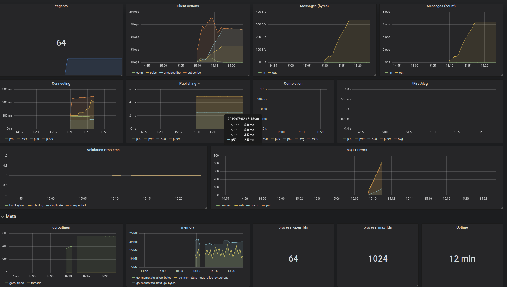

# MQ Hammer

MQ Hammer is an MQTT load testing and monitoring tool.

Stop! Hammer time! 

# :helicopter: Overview

MQ Hammer spins up a specified number of agents. Each agent has an MQTT connection to a broker and follows a scenario. A scenario dictates at which time an agent should subscribe or publish a message. Optionally, via a reference data set the correctness of received (retained) messages can be verified.

The primary output are metrics in the Prometheus exposition format. A summary of these metrics is output to the console as well.

MQ Hammer has been used to run 60k clients concurrently on commodity hardware.

One application of MQ Hammer is load testing. Another possible application is to run MQ Hammer continously with a moderate amount of agents and use its metrics to assess the performance of the system it targets.

# :construction_worker: Building

With a working Go environment and `dep` installed, and after a:

    make bootstrap test build

The binary will appear in `./build/mqhammer`.

# :rocket: Quick Start

In one terminal, subscribe with the [mosquitto client](https://mosquitto.org/download/):

    mosquitto_sub -h iot.eclipse.org -t '/mq-hammer/#' -v

In another terminal, run the example scenario with MQ Hammer:

    ./build/mqhammer --broker iot.eclipse.org -n 1 --scenario example/simple-scenario.json

While MQ Hammer runs, the mosquitto client will repeatedly output the following lines as MQ Hammer publishes:

    /mq-hammer/favourite/bird rollulus
    /mq-hammer/birds/rollulus rouloul

Note that `iot.eclipse.org` is a public sandbox broker [ran by the community](https://iot.eclipse.org/getting-started/). Do not abuse it by running more than a few agents; use your own broker for that. And note that since it is a public broker, when you run the example you might see other MQ Hammer users doing the same.

# :notebook: Usage

    $ ./build/mqhammer --help
    MQ Hammer is an MQTT load testing tool

    MQ Hammer will create --num-agents goroutines, each subscribing, unsubscribing
    and publish to topics at given timestamps according to the instructions in the
    --scenario file.

    It is possible to provide a reference data set that can be used for validation
    of static (and retained) data. With it, MQ Hammer knows when after a
    subscription the complete contents came in, how long it took to complete, if
    messages are missing, etc.

    By default, agents do not log to stderr to keep things clean a bit. For
    diagnostics, it is possible through --agent-logs to output logs to a file, one
    for each agent. Giving --agent-logs=- as argument will make the agents log to the
    default logger.

    All arguments can be specified through identically named environment variables
    as well.

    Usage:
    mqhammer [flags]
    mqhammer [command]

    Available Commands:
    help        Help about any command
    version     Print the version number of MQ Hammer

    Flags:
        --agent-logs string    Filename to output per-agent logs. Go-templated, e.g. 'agent-{{ .ClientID }}.log', or - to log to stderr
    -b, --broker string        Broker address, host[:port]; port defaults to 8883 for TLS or 1883 for plain text 
        --client-id string     Client ID prefix; a UUID is appended to it per agent to guarantee uniqueness (default "mq-hammer:v0.1.0-dirty:")
        --credentials string   Filename with username,password and client id in CSV
        --disable-mqtt-tls     Disable TLS for MQTT, use plain tcp sockets to the MQTT broker
    -h, --help                 help for mqhammer
    -k, --insecure             Don't validate TLS hostnames / cert chains
    -n, --num-agents int       Number of agents to spin up (default 1)
        --prometheus string    Export Prometheus metrics at this address (default ":8080")
    -r, --ref string           Filename with the expected reference data as JSON
    -s, --scenario string      Filename containing the scenario as JSON
        --sleep duration       Duration to wait between spinning up each agent (default 250ms)
    -v, --verbose              Verbose: output paho mqtt's internal logging (crit, err and warn) to stderr
    -w, --verboser             Verboser: output paho mqtt's internal logging (crit, err, warn and debug) to stderr

    Use "mqhammer [command] --help" for more information about a command.


Currently, the Scenarios are performed in this way: each agent starts at a random position and loops infinitely through the Scenario.

## Example

TODO

# :chart_with_upwards_trend: Metrics

Metrics are available to be scraped by Prometheus. An example Grafana dashboard to get you started can be found [here](./example/grafana/dashboard.json). The Dashboard looks like this:



## Console Metrics

The metrics are output to the console in a condensed form every two seconds and look like this:

    ag=64 subs=288 (70.5/s) unsubs=9 (3.0/s) pubs=31 (8.0/s) 1.622kB inmsgs=0 (0.0/s) 0B unexp=0 dup=0 miss=0 badpl=0 err={c=0,p=0,s=0,u=0}
    t_connect: 64 samples; 0.05% <= 46.917ms; 0.10% <= 47.481ms; 0.50% <= 54.133ms; 0.90% <= 70.384ms; 0.95% <= 75.062ms; 0.99% <= 82.67ms
    t_firstMsg - t_subscribe: 0 samples;
    t_lastMsg - t_firstMsg  : 0 samples;

The first line means that there are 64 agents, 288 subscriptions and 9 unsubscribptions have been made in total. A number of 31 messages has been published weighing 1.622kB, and 0 messages have been received. Then for the reference data, there were 0 unexpected messages received, 0 duplicates, 0 missing messages, 0 messages had an incorrect payload. Then `err` gives the mqtt errors encountered during connecting, publishing, subscribing and unsubscribing respectively.

The second line is a summary of the time it took to connect.

# :floppy_disk: Data File Formats

All data files, except for the credentials file, are in JSON. The credentials file is a CSV.

## Reference Set

The reference set is a map from topic to base64 encoded payload. E.g.:

```json
{
    "/tt/example/1/2/3/hello":"Y29vbAo=",
    "/tt/example/4/5/6/hello":"Y3JhcAo="
}
```

When this reference set it published under `/tt/example`, subscribing to `/tt/example/1/2/#` will result in a single message with key `/tt/example/1/2/3/hello` and payload "cool".

## Scenario

A scenario is an array of `Step` objects. Each `Step` has at least `t`, the relative time in seconds at which this Step is to be performed. Furthermore, it can contain a `publish`, a `subscribe` or a `disconnect`, each optional. `publish` is an array of messages to publish, objects with a topic and a base64 payload. `subscribe` is an array of topics to be subscribed to in this step. Any topics previously subscribed to, that are not in this set, are implicitely unsubscribed from. `disconnect` is a bool that makes the mqtt client disconnect. An example can be found [here](./example/simple-scenario.json).

## Credentials

Credentials are in CSV format, with in the first column the username, and the second column the password and the third column the client id.

# :art: Software Design

A rough outline of the dataflow is as follows.

A `Scenario` dictate the topics and pace. An `agent` subscribes / unsubscribes or publishes according to this. A `MessageHandlerer` provides message handlers that deal with incoming messages. It is either a (non-validating) `messageHandler` or a `validatingHandler`. Those handlers produce `events` like `subscribe` or `message`, which are collected by the `EventFunnel`, a `channeledFunnel` to be more concrete. In its `Process()` loop it computes metrics on incoming events.

# :couple: Related Work

- [MQTT JMeter Plugin](https://github.com/emqx/mqtt-jmeter);
- [MQTT Stresser](https://github.com/inovex/mqtt-stresser);
- [MQTTBox](https://www.hivemq.com/blog/mqtt-toolbox-mqttbox/).

# :handbag: Varia

Beware of your OS' limits:

    echo 16384 | sudo tee /proc/sys/fs/inotify/max_user_watches
    ulimit -n 16384
